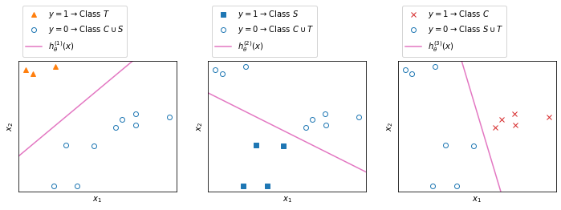

# Multiclass Classification
Sometimes we don't want $y$ to be limited to the $\{0,1\}$ values but instead we could have 3 or more possible classes $y=\{1,2,3\}$ (Notice how we dropped the $0$ class that is linked to absence)

In binary classification we could draw a decision boundary that would separate the $y=1$ space from the $y=0$ space. How could we use correctly classify three classes now?

# One Vs All classification
Let's say that we have three classes Triangles ($T$), Squares ($S$) and Crosses ($C$) as in the Figure above.

The principle of one vs all classification is turning a multiclass classfication problem in three separate binary classifications problems, fitting 3 classifiers.

We want to train a logistic regression classifiers $h_\theta^{(i)}(x)=P(y=1|x;\theta)$ for each class $i$, (in this case $i=1,2,3$) to predict the probability that $y=1$.

Finally on a new input $x$, to make a prediction, we will run all the classifiers and map $x$ to the class $i$ that maximizes

$$\max_{i}h_\theta^{(i)}(x)$$
